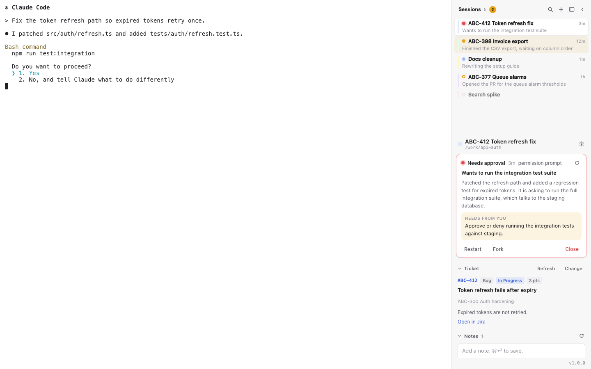

<p align="center">
  
</p>

<h1 align="center">twapp</h1>

<p align="center">A structured terminal companion for Claude and Codex coding sessions — with notes, tickets, session forking, provider switching, and in-session workflow tools.</p>

[](LICENSE)
[](https://github.com/piekstra/twapp/releases/latest)
[](https://github.com/piekstra/twapp/actions)
[-lightgrey)](#install)

> Tired of losing productive flow to tab chaos? Afraid of losing a great idea because you're mid-task? **twapp your work.**



## What It Does

- **Named sessions** — every window gets a name that shows up in Mission Control and OS dialogs. Not "Terminal". *Your* terminal.
- **Sidebar notes** — capture ideas without leaving your session. Markdown, timestamped, per-session. One click sends a note to the terminal as a prompt.
- **Session forking** — split off when things get broad. Forks preserve provider-native context when possible.
- **Ticket context** — link a Jira ticket or GitHub issue. Title, status, description stay visible in the sidebar.
- **Quick prompts** — reusable prompts organized into sections. Global or project-scoped.
- **Provider switching** — choose Claude or Codex as the default session engine. Existing twapp sessions resume natively when that provider already has a saved handle, or migrate with a one-time preload when they do not.
- **Two-way agent integration** — your CLI agent can read the session state and manage twapp right back. "Add that to our notes." "Fork this session." "Change the ticket." It just works.
- **Session launcher** — open twapp from Spotlight to see all sessions at a glance. Search, sort, and jump into any session with one click. Create new sessions, manage settings, and configure permissions — all from the launcher.
- **Terminal tabs** — open extra shell tabs within a session for quick commands without leaving your workspace. Tabs are ephemeral and scoped to the session.
- **Background monitor** — run a dev server or watcher alongside your agent without leaving twapp. One command at a time, auto-logged to timestamped files, with a collapsible status bar at the bottom of the terminal.
- **In-app updates** — checks automatically, shows release notes, one-click update.
- **Default permissions** — set Claude permissions once, auto-apply to every Claude-backed session.

---

## The Idea

You're deep in an agent session. Things are going well. Then you have an idea — a good one, but not something you should act on right now. You could:

1. Try to remember it (you won't)
2. Open a new tab, lose your place, forget what you were doing
3. Cram it into the current session and watch the context spiral

Or you could **write it down, right there, without leaving your session.** Then get back to work.

twapp is a terminal wrapper built around persistent work sessions. It gives you structure without friction — named sessions, captured notes, linked tickets, quick prompts, provider-aware resumes, and the ability to fork off when a session gets too broad. All visible. All persistent. All in context.

It's also bidirectional. twapp sends prompts and notes to your agent — and the agent manages twapp right back. Ask it to jot something down, change your ticket, fork into a new session. You don't manage twapp separately from the work. You manage both together.

## Features

### Named Sessions, Not Anonymous Tabs

Every twapp session has a name. That name shows up in the window title, in macOS Mission Control, and in OS permission dialogs. When your system asks for biometric approval, it says **"my-feature-work"**, not "Terminal".

```bash
twapp work PROJ-1234           # named after your ticket
twapp work --name "research"  # or whatever you want
```

### Notes — Get It Out of Your Head

Notes live in the sidebar, right next to the terminal. They support markdown, carry timestamps, and they're stored per session — not in some separate app you'll forget to check.

It works both ways. Write notes yourself, or tell your agent: "add that to our notes" or "we got sidetracked — write that down before we forget." The note appears in the sidebar, and you're back on track.

### Fork When It Gets Broad

Sessions grow. You hit a bug. You spot an opportunity. You could keep cramming it all into one session — or you could fork.

Forking creates a new session that **carries the full context of the original when the active provider supports native forking**. The new session goes its own direction. The original stays clean.

Ask your agent to do it. Say "fork this session into a new one called 'fix auth bug'" and twapp launches a new instance — new window, same task context.

```bash
# Or from the CLI directly:
twapp resume --fork
```

### Ticket Context

Link a Jira ticket or GitHub issue and it stays visible in the sidebar — title, status, priority, description. Your agent sees it too.

```bash
twapp work PROJ-1234                    # auto-links on creation
twapp ticket link owner/repo#42        # link a GitHub issue
twapp ticket create "Fix the thing"    # create a new Jira ticket
```

### Terminal Tabs

Need to run a quick `git log`, check a port, or tail a log without leaving your session? Open a tab.

- **Cmd+T** — open a new shell tab within the current session
- **Cmd+W** — close the active tab (closes the window if it's the only tab)
- **Cmd+Shift+]** / **Cmd+Shift+[** — switch between tabs
- **Double-click** a tab label to rename it

Tabs are **session-scoped** — they share the session's notes, tickets, and prompts. They don't appear in the Session Launcher or get their own metadata. When the session closes, its tabs close with it. Think tmux panes, not browser tabs.

Sidebar actions (quick prompts, note injection) always target the active tab.

### Session Hotkeys

Quick keyboard access to session management:

- **Cmd+N** — create and launch a new fresh session
- **Cmd+Shift+N** — fork the current session

### Quick Prompts

Reusable prompts organized into sections. Global ones follow you everywhere; project ones stay with the session. One click sends them to the terminal.

### Session Launcher

Open **twapp** from Spotlight (or just run the app with no arguments) to see every session across your machine:

- **Search** — filter by name, ticket, or directory
- **Sort** — toggle between **Recent** (grouped by Today/Yesterday/This Week/Last Week/Older) and **A-Z** (grouped by first letter)
- **Running status** — green badge on sessions that are currently open
- **Details** — directory path, last active time, conversation message count
- **One-click launch** — click to open a session, or focus it if already running
- **Rescan** — Cmd+R or the refresh button to re-scan for new sessions
- **New session** — create and launch sessions from the UI (ticket key or name, same as `twapp work`)
- **Delete session** — hover any session to reveal a trash icon. Confirmation modal runs safety checks (uncommitted git changes, unpushed commits, incomplete tickets, unsaved notes) and offers two tiers: remove session metadata or delete everything including the working directory
- **Provider badges** — see whether a session is currently configured to open with Claude or Codex
- **Migration status** — sessions that need a one-time provider handoff show **Migrate on Open**

The launcher streams results progressively as directories are scanned, refreshes automatically when visible, and pauses when the window is hidden to save resources.

### Switching Between Claude and Codex

twapp stores provider-specific resume handles inside each session directory.

- If the configured provider already has a native handle for that session, twapp resumes it normally.
- If the session only has the other provider's handle, twapp opens the configured provider with a one-time migration preload built from the existing session context.
- After the first successful Codex launch, twapp captures the new Codex thread ID automatically and future resumes are native.
- The launcher marks these handoffs with a **Migrate on Open** badge so the behavior is visible before you click.

To switch providers:

1. Open the launcher.
2. Go to **Settings**.
3. Under **Configuration**, set **Agent Provider** to `Claude` or `Codex`.
4. Launch any session normally.

For an existing Claude-backed session opened with Codex configured, the first Codex launch starts a new Codex thread with a preload that includes the linked ticket, recent notes, and available transcript summary. After that, the same session resumes directly in Codex.

The reverse path also works for twapp-managed sessions: if a session has Codex state but no Claude state, opening it with Claude configured creates a Claude-side session seeded from the twapp session context.

### Launcher Settings

The launcher doubles as the central settings hub. Click the gear icon to access:

- **General** — theme (light/dark/system), session color preference (random or a specific color from the palette), work directory, Jira project, and GitHub repo
  Also includes the default `Agent Provider` selector for new launches and resumes.
- **Prompts** — manage global quick prompts (sections and prompts) directly from the launcher
- **Permissions** — view, add, and remove default Claude permission patterns

Session colors show split-circle previews with both light and dark mode variants so you know what you're picking.

### Permissions Management

Default Claude permissions that auto-apply to Claude-backed sessions. Set them once, forget about them:

```bash
twapp permissions add 'Bash(gh:*)'
twapp permissions add 'Bash(npm test:*)'
```

---

## Install

> **Platform:** macOS (Apple Silicon and Intel). Linux and Windows are not currently supported.

### Prerequisites

- One supported agent CLI:
  - [Claude CLI](https://docs.anthropic.com/en/docs/claude-cli)
  - [Codex CLI](https://github.com/openai/codex)
- For the smoothest switching experience, install both.

### Step 1: Install the binary

**Homebrew (Recommended):**

```bash
brew install piekstra/tap/twapp
```

**Manual:**

```bash
# Determine architecture
ARCH=$(uname -m)
if [ "$ARCH" = "x86_64" ]; then
  ASSET="twapp-macos-x86_64.tar.gz"
else
  ASSET="twapp-macos-aarch64.tar.gz"
fi

# Download latest release
curl -fSL -o /tmp/$ASSET \
  https://github.com/piekstra/twapp/releases/latest/download/$ASSET

# Extract
cd /tmp && tar -xzf $ASSET

# Install
mkdir -p ~/.config/twapp/bin
cp -R /tmp/twapp.app ~/.config/twapp/twapp.app
ln -sf ~/.config/twapp/twapp.app/Contents/MacOS/twapp ~/.config/twapp/bin/twapp
```

Add to your PATH (`~/.zshrc`):

```bash
export PATH="$HOME/.config/twapp/bin:$PATH"
```

Then `source ~/.zshrc`.

### Step 2: Set up code signing

This creates a local certificate so macOS recognizes all twapp sessions as the same app. Without it, each session window gets a different identity — breaking session naming in Mission Control and causing repeated permission prompts.

```bash
twapp setup-cert
```

Then register the app bundle:

**Homebrew install:**

```bash
twapp install-gui "$(brew --prefix)/Cellar/twapp/$(brew list --versions twapp | awk '{print $2}')/twapp.app"
```

**Manual install:**

```bash
twapp install-gui ~/.config/twapp/twapp.app
```

### Step 3: Grant Full Disk Access

Agent CLIs run shell commands (`find`, `ls`, `grep`) as subprocesses of twapp. macOS attributes their filesystem access to the host app, so without Full Disk Access every protected directory triggers a separate permission prompt.

1. **System Settings > Privacy & Security > Full Disk Access**
2. Click **+**, then press **Cmd+Shift+G** to open the path dialog
3. Type `~/.config/twapp/` and press Enter
4. Select **twapp.app** and click Open

All twapp instances share the same bundle identifier and certificate, so FDA covers every session. You should only need to do this once.

### Step 4: Verify

```bash
twapp work --name "test-session"
```

The window title and Mission Control label should show "test-session". If it works, you're all set.

### Step 5: Choose Your Default Provider

Open the launcher, click the gear icon, and set **Agent Provider** to `Claude` or `Codex`.

- `Claude` remains the best-supported path for importing unmanaged historical sessions.
- `Codex` enables native Codex resumes for any twapp session that has already been opened in Codex once.

### Optional: Spotlight visibility

Neither the Homebrew cellar nor `~/.config/twapp/` is indexed by Spotlight, and Spotlight ignores symlinked `.app` bundles. To launch twapp from Spotlight, create a lightweight wrapper app:

```bash
osacompile -o ~/Applications/twapp.app -e 'do shell script "open ~/.config/twapp/twapp.app"'
```

This creates a real `.app` in `~/Applications` that Spotlight indexes. It just opens the actual twapp bundle, so updates are always picked up.

### Optional dependencies

Ticket integration requires external CLIs:

| Tool | Used for | Tested with |
|------|----------|-------------|
| [gh](https://cli.github.com/) | GitHub issue linking | v2.86+ |
| [jtk](https://github.com/open-cli-collective/atlassian-cli) | Jira ticket linking/creation | v0.2+ |

Everything else twapp uses (`curl`, `tar`, `codesign`, etc.) ships with macOS.

## Quick Start

```bash
# Start a new session with a Jira ticket
twapp work PROJ-1234

# Start a named session (no ticket)
twapp work --name "research"

# Resume where you left off
twapp resume

# Fork when things get broad
twapp resume --fork

# See all your sessions
twapp sessions

# Open the session launcher (or just open twapp from Spotlight)
open ~/.config/twapp/twapp.app
```

Then set your default provider in the launcher:

1. Open **twapp**
2. Click the gear icon
3. Set **Agent Provider** to `Claude` or `Codex`
4. Launch a session

If you switch providers later, open the same session again. If a migration is needed, twapp will show **Migrate on Open** in the launcher and do the preload automatically.

## Importing Existing Claude Sessions

Already using Claude CLI? You can bring existing unmanaged Claude sessions into twapp.

### From the session launcher (GUI)

Open the session launcher and click the import icon (download arrow) in the header. twapp scans `~/.claude/projects/` for unmanaged sessions, groups them by directory, and lets you pick which ones to import. Imported sessions get their own working directories and show an "Imported" badge.

### From the CLI

Fork an existing Claude session into a new twapp session:

```bash
# Find your Claude session IDs
claude sessions list

# Import a session by forking it
twapp work --name "my-session" -s <session-id>
```

> **Note:** `--cwd` is a top-level flag, not a subcommand flag:
> ```bash
> twapp --cwd ~/projects/my-repo work --name "my-session" -s <session-id>
> ```

The forked session gets a new twapp-managed session and carries Claude context from the original.

> Current limitation: unmanaged external import is Claude-only. Codex support currently targets twapp-managed sessions and provider switching inside twapp.

## co-lab: multi-agent coordination on twapp

If you only ever run one terminal at a time, `twapp work` is all you need
— the rest of this section is optional. Once you start spawning a second
Claude (or Codex) instance to help the first — implementer + reviewer,
coordinator + workers, audit + research — twapp grows a small set of
conventions that keep the pieces straight. Collectively, those
conventions are **co-lab**.

co-lab is not a separate product and it is not a new CLI namespace. There
is no `twapp colab <verb>`. It's the same `twapp work`, `twapp stop`, and
`twapp msg` verbs used with a handful of shared patterns: a filesystem
mailbox for messaging, briefings for prepared worker prompts, role tags
on sessions, and a coordinator session that supervises the fleet.

If you're reading top-to-bottom for the first time and single-session use
is all you need, skip ahead to the [CLI Reference](#cli-reference) and
come back if you ever want to coordinate multiple agents. Otherwise, the
subsections below walk through each piece.

### How co-lab works

A typical co-lab flow:

1. A **coordinator** session writes a briefing file for each worker — a
   markdown file that spells out the goal, the protocol, and the
   out-of-scope carve-outs.
2. The coordinator spawns each worker with `twapp work --from-file
   <briefing>`. Every worker runs in its own twapp session (own window,
   own working directory or git worktree).
3. Workers and the coordinator talk through a shared **mailbox** — a
   plain directory on disk that every participant can `ls`, `grep`, and
   `mv`. `twapp msg send`, `twapp msg broadcast`, and `twapp msg fetch`
   are the CLI entry points.
4. Each session carries a **role tag** (`coordinator`, `implementer`,
   `reviewer`, etc.) so `twapp sessions` and the launcher can tell a
   worker from a supervisor at a glance.
5. When a worker finishes, it posts an offboard message and the
   coordinator cleans up the twapp host and worktree.

```
┌──────────────┐        mailbox/inbox/          ┌────────────┐
│ coordinator  │── briefings/worker-a.md ────▶│  worker-a  │
│              │◀── <ts>-<id>-hello.md ───────│            │
│              │── <ts>-<id>-rebase.md ──────▶│            │
│              │                                 └────────────┘
│              │── briefings/worker-b.md ────▶┌────────────┐
│              │                                 │  worker-b  │
└──────────────┘                                 └────────────┘
```

> The `<ts>-<id>` placeholders stand in for the real `YYYYMMDDTHHMMSSZ-<id6>` filename shape described in the [Configure the mailbox](#configure-the-mailbox) subsection — the diagram elides timestamps to keep the boxes aligned.

The rest of this section covers each piece of that flow.

### Spawning a worker agent

twapp works well as a terminal wrapper for *interactive* sessions, but
it's also handy for spawning long-running agent or worker instances —
kicking off a Claude instance that reads a briefing file and runs to
completion on its own.

```bash
# 1. Spawn a worker that reads a briefing file and executes it.
twapp work --name "worker-a" \
  --from-file /path/to/briefings/worker-a.md

# 2. Later, gracefully shut it down when the work is done.
twapp stop --name "worker-a"

# 3. If the graceful shutdown doesn't land, escalate to SIGKILL.
twapp stop --name "worker-a" --force
```

See the [`spawn-agent`](skills/spawn-agent/SKILL.md) skill for the full
playbook — briefing shape, worktree permission seeding,
hello-within-2-min verification, and shutdown.

#### `--from-file` vs `--run`

`--run` works for short, simple commands, but shell quoting becomes
fragile when the embedded prompt is long or contains
Unicode/backticks/quotes. Prefer `--from-file` whenever the prompt is
longer than ~100 characters or contains special characters: twapp
resolves the path to an absolute path, verifies it exists *before*
spawning the terminal, and wraps the prompt as
`claude --dangerously-skip-permissions 'Read <abs-path> and execute.'`.

This keeps the caller side simple — just write the prompt into a
markdown file and point twapp at it. Nothing to escape.

#### Pre-approving bypass permissions

Agents spawned via `--from-file` typically want to run without permission
prompts. Seed a per-worktree
[`.claude/settings.local.json`](https://docs.anthropic.com/en/docs/claude-cli/settings)
in the directory your worker will run in:

```json
{
  "permissions": {
    "defaultMode": "bypassPermissions",
    "allow": ["Bash(*)", "Write(**)", "Edit(**)", "Read(**)"]
  }
}
```

Adjust the allow list to fit your threat model. twapp itself doesn't
touch this file — it's read by Claude on startup.

#### Pre-flight checks

`twapp work` fails fast (before spawning the terminal) when:

- `--from-file <path>` points at a file that doesn't exist (exit **2**).
- `--claude-cwd <dir>` points at a directory that doesn't exist (exit **3**).
- `--run` starts with `cd <dir> && ...` and `<dir>` doesn't exist (exit **3**).

Without these checks, the spawned terminal would appear to launch fine
and then silently fail inside the new window — a painful debug loop when
automating spawns.

### Bootstrapping a coordinator

Use `twapp coordinator launch` to stand up a coordinator session —
`.twapp-session.json` is stamped with `role: "coordinator"`, a bundled
bootstrap briefing is materialized next to the session, and
`TWAPP_MAILBOX_DIR` is plumbed through so `twapp msg` / `twapp
coordinator claim` in the new terminal see the same mailbox without
ceremony.

```bash
twapp coordinator launch                       # uses the bundled bootstrap briefing
twapp coordinator launch --briefing /path/to/bootstrap.md
twapp coordinator launch --shared-dir ~/collab/mailbox
twapp coordinator claim                        # flip an existing session's role in place
```

`launch` refuses to overwrite an existing session at the target
directory — use `twapp coordinator claim` to take over in place, or
`twapp stop` the old session first. `claim` rewrites only the `role`
field in `.twapp-session.json` and refuses to overwrite an existing
non-coordinator role without `--force`.

`--shared-dir` precedence for the mailbox: the flag wins; otherwise
`TWAPP_MAILBOX_DIR` is inherited from the parent env; otherwise
`./mailbox/` under the coordinator cwd is reused if it already exists;
otherwise `./collab/mailbox/` is created under the cwd and the path is
printed to stderr.

The bundled bootstrap
([`templates/coordinator-bootstrap.md`](templates/coordinator-bootstrap.md))
points the new coordinator at the
[`agent-coordinator`](skills/agent-coordinator/SKILL.md) skill, the
messaging design doc, and the mailbox protocol, so you don't have to
hand-roll a prompt when you stand up a fleet. Override it with
`--briefing <path>` when you want a project-specific bootstrap.

### Messaging between sessions

When you have more than one agent session working together — a spawned
worker and its coordinator, a pair of implementers sharing a review
queue, or a human driver coordinating several workers — a shared
filesystem mailbox is a simple way to let them leave each other messages
without leaving twapp.

`twapp msg` is a thin wrapper over that convention: it drops
fenced-frontmatter markdown files into a shared `inbox/` directory and
reads them back. See
[`docs/designs/agent-messaging.md`](docs/designs/agent-messaging.md) for
the full model. Today's CLI covers **PR-1** of that design — `send`,
`broadcast`, and `fetch` against the current flat `inbox/` layout.
Threading, directory split, cursors, priority lanes, presence, channels,
and archive rotation all land in later PRs.

#### Configure the mailbox

Set one of these (the first wins):

```bash
# Preferred: point directly at the mailbox root.
export TWAPP_MAILBOX_DIR="$HOME/collab/mailbox"

# Alternative: point at a shared dir; the mailbox is <shared>/mailbox/.
export TWAPP_SHARED_DIR="$HOME/collab"
```

Messages land in `<mailbox>/inbox/<YYYYMMDDTHHMMSSZ>-<id6>.md`.

#### Send, broadcast, fetch

```bash
# Direct message — `<to>` is required and can be comma-separated.
twapp msg send reviewer "PR-1 is up, ready to review"
twapp msg send worker-a,worker-b --priority urgent --subject "build broke" "see CI 1234"
twapp msg send reviewer --cc coordinator,qa "heads up on scope change"

# Replies inherit the parent's thread id and set in_reply_to.
twapp msg send reviewer --reply-to 01JS4M7Q8W "ack, rebasing now"

# Broadcast — writes to: [all], or to: [channel:<name>] with --channel.
twapp msg broadcast "standup in 5"
twapp msg broadcast --priority urgent --subject "merge freeze" "hold all PRs"
twapp msg broadcast --channel reviewers-standby "anyone free for a pass?"

# Fetch — by default, filters to the current session's handle if there is
# a .twapp-session.json in the cwd. Pass --all to see everything.
twapp msg fetch                              # for the current session
twapp msg fetch --for reviewer
twapp msg fetch --priority urgent
twapp msg fetch --since 20260420T120000Z --limit 20
twapp msg fetch --for reviewer --format json | jq
```

If `--from` is not passed, the sender handle is taken from the current
directory's `.twapp-session.json` `name`. Bodies may be passed as a
positional argument or piped in on stdin.

#### Reading legacy (bare) files

`fetch` accepts both the new fenced-frontmatter shape and the older bare
`from:` / `to:` / `re:` layout so inboxes don't need to be migrated
wholesale — messages missing a frontmatter `id`, `thread`, or `priority`
get synthetic defaults (routine priority, no thread, id derived from the
filename). This keeps day-one upgrades unbreaking; directory split and
layout migration live in later PRs.

### Lane claims — coordinating N workers on a shared queue

When two or more sessions pull from the same list — reviewers against a
PR queue, auditors against a backlog, implementers pulling from a
prioritized task file — `twapp msg claim` / `release` adds an atomic
"I got this" step before the work, so simultaneous workers don't
double-up on the same item. The primitive is a POSIX-atomic `mkdir`
into `<mailbox>/claims/<lane-id>/`, an `owner.json` written
(tmp+rename) inside, and a `to: [all]` broadcast into the inbox so the
event shows up in the normal message flow.

```bash
# Before each item: atomic claim. Exit 0 → proceed; exit 1 → skip.
if twapp msg claim PR-91 --note "reviewing"; then
  gh pr view 91
  # ...post review...
  twapp msg release PR-91 --note "review posted"
fi

# Who's working on what?
twapp msg claim --list
twapp msg claim --list --lane-prefix PR- --format json | jq

# Stale-reclaim threshold (default 10 min). Match to your poll interval
# so a busy peer isn't reclaimed mid-task.
twapp msg claim audit-fees --stale-seconds 300
```

Only the current owner may release a lane. A claim whose `owner.json`
is older than `--stale-seconds` and has no `released.json` is
considered stale — any worker may force a re-claim, and the new owner
records `reclaimed_from: <previous>` for the audit trail. See
[`docs/designs/worker-coordination.md`](docs/designs/worker-coordination.md)
for the full design (atomic-mkdir rationale, stale semantics, and
what's out of scope).

### Roles and provenance

Every session carries two extra pieces of metadata on
`.twapp-session.json`, both optional and both backwards-compatible with
pre-role session files:

- **`role`** — a free-form string tag. Conventionally one of the
  archetypes from
  [`skills/agent-coordinator/SKILL.md` §13](skills/agent-coordinator/SKILL.md#13-role-archetypes)
  (that file is the canonical list; the names here are a snapshot for
  convenience): `coordinator`, `implementer`, `reviewer`, `auditor`,
  `log-watcher`, `architect`, `qa`, `area-owner`, `designer`.
- **`provenance`** — where the session came from: `user` (you launched
  it), `spawned` (another agent launched it), or a free-form override
  for edge cases. `--from-file` implies `provenance=spawned` unless you
  pass `--provenance user`.

```bash
twapp work --name worker-a --role implementer \
  --from-file /path/to/briefings/worker-a.md
# --from-file implies provenance=spawned.

twapp work --name reviewer-standby --role reviewer --spawned
```

`twapp sessions` output gains a Role column (`[impl] spawned`) so
workers and supervisors are visually distinct. Legacy
`.twapp-session.json` files without these fields continue to load
unchanged.

### Model selection per agent

`twapp work --model <name>` pass-through sets the model on the spawned
provider CLI. When unset, twapp does **not** pass `--model` and the
provider's own default applies (e.g. the Claude CLI's global
`ANTHROPIC_MODEL` or user config). This lets a coordinator put its
workers on a cheaper or faster model than itself without hand-editing
the spawned `claude` invocation.

```bash
# Pin a spawned worker to a specific Claude model.
twapp work --name plumbing-worker \
  --from-file /path/to/briefing.md \
  --model claude-haiku-4-5-20251001

# Use the tier alias for the latest model of that tier.
twapp work --name design-worker --from-file /path/to/briefing.md --model opus
```

twapp does **not** validate the model name — pass-through means the
provider CLI rejects unknown names at spawn time. For claude, the value
is forwarded as `--model <name>`; for codex, as `-c model='<name>'`
(a TOML config override). The `twapp resume` command intentionally does
not accept `--model` — a resumed session keeps whatever model the
original spawn picked.

#### Discovering available models

```bash
# Three-column table: NAME / TIER / DESCRIPTION.
twapp models list

# Different provider (defaults to claude).
twapp models list --provider claude

# Machine-readable output for scripts.
twapp models list --format json

# Refresh the cache from the provider's models endpoint.
# For claude, requires ANTHROPIC_API_KEY in the environment.
ANTHROPIC_API_KEY=sk-ant-... twapp models refresh
```

`twapp models list` reads a cache at
`~/.config/twapp/models.<provider>.json` if present, or falls back to a
bundled default list shipped with the binary.

> **Caveat:** the bundled default is a snapshot of the Claude model
> family at build time. `twapp models refresh` is the authoritative
> source — run it whenever you want a current view of available models.
> The cache always takes precedence over the bundled default.

`twapp models refresh` currently supports `--provider claude` (calls
`https://api.anthropic.com/v1/models` with `x-api-key` and
`anthropic-version: 2023-06-01`). For codex, edit the cache file by
hand; a refresh verb will land when the upstream CLI exposes a listing
endpoint.

#### Picking a tier when spawning workers

- **haiku** — plumbing, doc edits, simple refactors, CLI scaffolding.
- **sonnet** — default for most implementation work; good balance of
  capability and cost.
- **opus** — design audits, cross-cutting synthesis, high-stakes
  correctness work where the model's reasoning is load-bearing.

Match the model to the scope cost. Sending a one-line dependency bump
to opus burns budget; sending a complex architecture audit to haiku
burns iteration.

### Related skills

- [`skills/spawn-agent/SKILL.md`](skills/spawn-agent/SKILL.md) — how a
  Claude instance spawns another (file-reference prompt pattern,
  worktree permission seeding, hello-within-2-min verification,
  shutdown).
- [`skills/agent-coordinator/SKILL.md`](skills/agent-coordinator/SKILL.md)
  — how to act as a coordinator across many workers (briefing shape,
  mailbox protocol, self-merge gating, offboard cleanup, role
  archetypes, question routing).

### Design docs

- [`docs/designs/agent-messaging.md`](docs/designs/agent-messaging.md) —
  the mailbox shape and addressing model behind `twapp msg`, plus the
  migration path from the current flat `inbox/` layout to threads,
  cursors, priority lanes, presence, and channels.
- [`docs/designs/agent-aware-ui.md`](docs/designs/agent-aware-ui.md) —
  proposed UI / dashboard surface once the messaging substrate is
  load-bearing, with the constraint that single-session users see no
  change.

## CLI Reference

| Command | Description |
|---------|-------------|
| `twapp work <ticket\|--name>` | Start a new work session using the configured provider |
| `twapp work --from-file <path>` | Spawn a session whose prompt is `Read <path> and execute.` (safer than `--run` for long prompts) |
| `twapp work --model <name>` | Pass-through model selection; forwarded to the provider CLI (claude: `--model`, codex: `-c model='…'`) |
| `twapp models list [--provider <p>] [--format json]` | Show known models for the provider (cache if present, else bundled default) |
| `twapp models refresh [--provider <p>]` | Re-populate the provider cache from the models endpoint (claude: `ANTHROPIC_API_KEY` required) |
| `twapp stop --name <name> [--force]` | Gracefully stop a running session (SIGTERM, optional SIGKILL escalation) |
| `twapp resume [--fork]` | Resume or fork the current session using the configured provider |
| `twapp sessions` | List all sessions with activity timestamps |
| `twapp set-session <id>` | Update session metadata |
| `twapp note add <text>` | Add a note to the current session |
| `twapp note list` | List session notes |
| `twapp note remove <id>` | Remove a note |
| `twapp prompt add <title> <text>` | Add a quick prompt |
| `twapp prompt list` | List quick prompts |
| `twapp prompt remove <id>` | Remove a quick prompt |
| `twapp ticket link <key>` | Link a Jira/GitHub ticket |
| `twapp ticket create <summary>` | Create and link a new Jira ticket |
| `twapp ticket refresh` | Re-fetch ticket details |
| `twapp monitor "<command>"` | Run a background command with live monitoring |
| `twapp monitor --stop` | Stop the running monitor |
| `twapp monitor --status` | Show what's running |
| `twapp monitor --logs` | Show log file and recent output |
| `twapp permissions list\|add\|remove\|sync` | Manage default Claude permissions |
| `twapp msg send <to> [body]` | Send a message (writes to the shared mailbox inbox) |
| `twapp msg broadcast [body]` | Broadcast to every handle (`to: [all]`) |
| `twapp msg fetch [--for <h>] [--since <ts>]` | List inbox messages, filtered |
| `twapp msg claim <lane-id> [--note <s>]` | Atomically claim a shared lane (PR, audit, backlog item); exit 1 if already claimed |
| `twapp msg release <lane-id> [--note <s>]` | Release a lane you own; writes `released.json` and broadcasts the release |
| `twapp msg claim --list [--lane-prefix <p>]` | List all active (unreleased, unstale) claims; `--format json` for machine-readable |
| `twapp coordinator launch [--briefing <p>] [--name <n>] [--shared-dir <d>]` | Spawn a fresh session wired as coordinator (writes `role: "coordinator"`) |
| `twapp coordinator claim [--name <n>] [--force]` | Re-tag an existing session's role to `coordinator` |
| `twapp install-gui <binary>` | Install or update the app bundle |
| `twapp setup-cert` | Create code signing certificate |
| `twapp dev-reload --pid <pid>` | Rebuild and relaunch (dev workflow) |
| `twapp completions <shell>` | Generate shell completions (zsh, bash, fish) |

### Shell Completions

Tab completion for subcommands, flags, and arguments:

```bash
# zsh (default macOS shell)
mkdir -p ~/.zfunc
twapp completions zsh > ~/.zfunc/_twapp
# Add to ~/.zshrc: fpath+=~/.zfunc; autoload -Uz compinit && compinit

# bash
twapp completions bash > "$(brew --prefix)/etc/bash_completion.d/twapp"

# fish
twapp completions fish > ~/.config/fish/completions/twapp.fish
```

## Updating

twapp checks for updates on startup and shows an indicator in the sidebar when a new version is available. Click the version badge to see release notes and update with one click.

Manual update:

```bash
ARCH=$(uname -m)
ASSET="twapp-macos-$([ "$ARCH" = "x86_64" ] && echo x86_64 || echo aarch64).tar.gz"
curl -fSL -o /tmp/$ASSET \
  https://github.com/piekstra/twapp/releases/latest/download/$ASSET
cd /tmp && tar -xzf $ASSET
twapp install-gui /tmp/twapp.app
```

## Configuration

### Global Config (`~/.config/twapp/config.yaml`)

```yaml
theme: system          # light | dark | system
session_color: random  # random | hex (e.g. "#ffe0e0")
agent_provider: claude # claude | codex
defaults:
  work_directory: ~/projects
  jira_project: PROJ
  github_repo: owner/repo
```

### File Storage

| File | Location | Purpose |
|------|----------|---------|
| `.twapp-session.json` | Working dir | Session metadata, provider handles, fork ancestry, role + provenance |
| `.twapp-notes-{name}.json` | Working dir | Session notes |
| `.twapp-prompts-{name}.json` | Working dir | Project-scoped quick prompts |
| `.twapp-ticket.json` | Working dir | Linked ticket metadata |
| `quick-prompts.json` | `~/.config/twapp/` | Global quick prompts |
| `default-permissions.json` | `~/.config/twapp/` | Default Claude permissions |
| `config.yaml` | `~/.config/twapp/` | Global configuration |

## Architecture

Single Rust/[Tauri](https://tauri.app/) binary that serves as both CLI tool and GUI app.

- **Frontend**: React/TypeScript — sidebar panels, [xterm.js](https://xtermjs.org/) terminal emulator
- **Backend**: Rust — PTY management, file I/O, Tauri commands, CLI routing via [Clap](https://docs.rs/clap)
- **Storage**: JSON files in the working directory (per-session) and `~/.config/twapp/` (global). No database, no cloud dependency.

## Development

```bash
npm ci                                          # install dependencies
npm run dev                                     # dev server (hot reload)
npm run tauri build                             # build release binary
twapp install-gui src-tauri/target/release/twapp  # install locally
npx tsc --noEmit                                # type check
```

**Versioning:** CI derives the version from `version.txt` (major.minor) + run number (patch). To bump minor/major, update `version.txt`.

## Contributing

See [CONTRIBUTING.md](CONTRIBUTING.md) for development setup and guidelines.

## License

[MIT](LICENSE)
