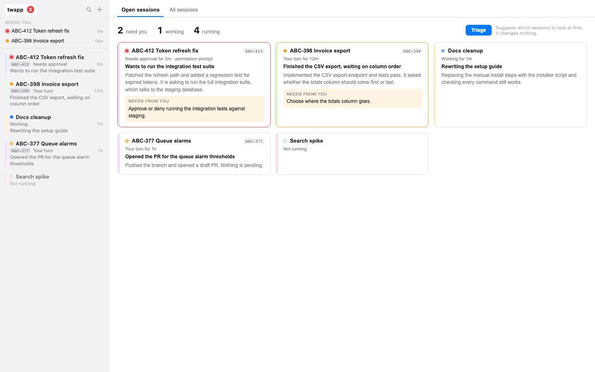

<p align="center">
  
</p>

<h1 align="center">twapp</h1>

<p align="center">One window for all of your Claude, Codex and Antigravity sessions: what each one is doing, which ones need you, and a fast way to switch between them.</p>

[](LICENSE)
[](https://github.com/piekstra/twapp/releases/latest)
[](https://github.com/piekstra/twapp/actions)
[-lightgrey)](#install)


## What it does

You run several agent sessions at once. Each one is somewhere between working, waiting for an answer, and blocked on a permission prompt, and finding the one that needs you means cycling through windows. twapp puts every session in one window and keeps track of that for you.

- **Every session in one sidebar.** The sidebar lists every session with its state, how long it has been in that state, and a one-line summary, above the selected session's details. It sits on the right by default so the terminal starts at the window's left edge; it can move to the left, split into a session list on the left and details on the right, or collapse to a strip a few pixels wide with one colored tick per session.
- **Live state, no setup.** twapp reads the signals the harnesses already produce (Claude's session status files and transcripts, Codex's session logs, terminal titles and notifications) to tell working, needs approval, your turn, errored, and exited apart.
- **Summaries.** When a session finishes a turn or stops on a prompt, twapp asks your preferred harness, headless and with no tools, to summarize what the session did and what it needs from you. Sessions carry their own titles until a summary arrives.
- **Triage.** The overview has a Triage action that reads every running session and suggests which ones to look at first and why. It is advice for you; twapp never tells an agent what to do.
- **Fast switching.** `⌘1` to `⌘9`, `⌘J` for the next session that needs you, and `⌘K` for a palette that switches to, opens or starts anything.
- **Sessions survive the window.** Terminals live in a small background host, so quitting, updating or crashing the window leaves every agent running. The window reattaches when it opens.
- **Per-session context.** Notes, a linked Jira ticket or GitHub issue (changeable at any time), session color, harness, and extra shell tabs. Quick prompts are global and the same in every session.
- **Light on the machine.** One window, one web view and one GPU context, however many sessions are open. Only the terminal on screen renders.



## Install

> **Platform:** macOS (Apple Silicon and Intel).

### Prerequisites

At least one supported agent CLI:

- [Claude Code](https://docs.anthropic.com/en/docs/claude-code)
- [Codex CLI](https://github.com/openai/codex)
- Antigravity (`agy`)

### Step 1: Install the app

**Homebrew (recommended):**

```bash
brew install piekstra/tap/twapp
```

**Manual:**

```bash
ARCH=$(uname -m)
ASSET="twapp-macos-$([ "$ARCH" = "x86_64" ] && echo x86_64 || echo aarch64).tar.gz"
curl -fSL -o /tmp/$ASSET https://github.com/piekstra/twapp/releases/latest/download/$ASSET
cd /tmp && tar -xzf $ASSET
mkdir -p ~/.config/twapp/bin
cp -R /tmp/twapp.app ~/.config/twapp/twapp.app
ln -sf ~/.config/twapp/twapp.app/Contents/MacOS/twapp ~/.config/twapp/bin/twapp
```

Add `~/.config/twapp/bin` to your `PATH` in `~/.zshrc`:

```bash
export PATH="$HOME/.config/twapp/bin:$PATH"
```

### Step 2: Sign the app

A local signing certificate keeps macOS from asking for the same permissions again after every update.

```bash
twapp setup-cert
twapp install-gui ~/.config/twapp/twapp.app
```

For a Homebrew install, pass the cellar bundle instead:

```bash
twapp install-gui "$(brew --prefix)/Cellar/twapp/$(brew list --versions twapp | awk '{print $2}')/twapp.app"
```

### Step 3: Grant Full Disk Access

Agent CLIs run shell commands as subprocesses of twapp, and macOS attributes their file access to twapp. Without Full Disk Access every protected directory raises its own prompt.

1. **System Settings > Privacy & Security > Full Disk Access**
2. Click **+**, press **⌘⇧G**, type `~/.config/twapp/` and press Enter
3. Select **twapp.app** and click Open

### Step 4: Open it

```bash
twapp work --name "first session"
```

The window opens with the session selected. To launch twapp from Spotlight, create a small wrapper app, because Spotlight skips `~/.config` and symlinked bundles:

```bash
osacompile -o ~/Applications/twapp.app -e 'do shell script "open ~/.config/twapp/twapp.app"'
```

### Optional tools

| Tool | Used for |
|------|----------|
| [jtk](https://github.com/open-cli-collective/atlassian-cli) 1.3 or later | Jira ticket linking and creation |
| [gh](https://cli.github.com/) | GitHub issue linking |

## Using it

### Starting and opening sessions

```bash
twapp work ABC-1234               # new session for a Jira ticket, named after it
twapp work owner/repo#42          # new session for a GitHub issue
twapp work --name "research"      # new session without a ticket
twapp work ABC-1234 --background  # start it without switching to it
twapp resume                      # open the session in the current directory
twapp status                      # what every open session is doing
```

A session is a directory holding a `.twapp-session.json` file. `twapp work` creates the directory under your configured work directory and hands the session to the window, starting the window if it is not running. In the window, `⌘N` starts a new session and `⌘K` opens any session twapp knows about.

### States

| State | Meaning |
|-------|---------|
| Working | The harness is running a turn. |
| Needs approval | A permission prompt or other dialog is waiting for your answer. |
| Your turn | The turn finished and the harness is waiting for your next message. A filled dot means you have not looked at it since. |
| Error | The last turn ended with an API or harness error. |
| Shell | The harness exited and the tab is back at a shell prompt. |
| Not running | The session is in the rail but not started. It starts when you select it. |

The dock icon shows how many sessions need you and bounces once when a session starts waiting while twapp is in the background.

### Keyboard

| Shortcut | Action |
|----------|--------|
| `⌘1` to `⌘9` | Select the session at that position among the rows showing |
| `⌘J` | Next session that needs you |
| `⌘K` | Switch to, open or start anything |
| `⌥⌘↑` / `⌥⌘↓` | Previous or next session |
| `⌘0` | Overview |
| `⌘N` / `⌘⇧N` | New session / fork the current one |
| `⌘T` / `⌘W` | New shell tab / close the shell tab |
| `⌘⇧[` / `⌘⇧]` | Previous or next tab |
| `⌘\` | Collapse the sidebar to a thin bar, or expand it |
| `⌘⇧\` | In the split layout, collapse or expand the session list |
| `⌘,` | Settings |
| `⌘=` / `⌘-` / `⌘⇧0` | Zoom in, out, reset |

The session list has three lanes: **Priority**, **Background** and **Blocked**. Drag a row within a lane to reorder it or onto another lane to move it; right-click a row, or use the lane control under the session's name, to move it without dragging. Your order is kept between launches. A new session opened with a command starts in Priority; a restored or adopted one starts in Background.

Blocked is for a session you are keeping open while you wait on someone else. It does not count toward the sessions that need you or the dock badge, except when its harness asks for a permission, and its row shows how long it has been blocked and when you last checked on it. Sending the session a message restarts the "checked" clock; the session stays blocked until you move it.

Each lane folds from its header. The list next to a session's details starts with only Priority open, the sessions you switch between most; the full list in the split layout and the overview start with everything but Blocked open. `⌘1` to `⌘9` count the rows that are showing. The layout button in the list's header picks where the sidebar goes. A collapsed sidebar shows the full sidebar while you hover it, and a one-line status bar above the terminal carries the selected session's state, what it needs from you, and how many other sessions need you.

### Notes, tickets and prompts

The sidebar shows the selected session's details first (its state, summary, ticket, notes and your quick prompts) and the session list below them; the layout menu can put the list on top instead. The summary starts collapsed to its state line in the session you are working in; click it to expand.

- **Notes** are Markdown and belong to the session. `↵` on a note types it into the terminal and removes it from the list.
- **Tickets** accept a Jira key (`ABC-1234`), a bare number (prefixed with your configured Jira project), or a GitHub issue (`owner/repo#42` or `#42`). Change or unlink them from the panel, or with `twapp ticket link <ref>`.
- **Quick prompts** are shared by every session. Clicking one types it into the terminal without submitting it.

Agents in a session can use the same data from the CLI: `twapp note add`, `twapp ticket link`, `twapp prompt add`.

### Forking

Fork a session (`⌘⇧N`, or Fork in the panel) to start a new session that carries the current conversation's context. With a ticket, the fork gets the ticket's directory; without one, it gets a sibling directory next to the original. `twapp work <ticket> -s <session-id> --claude-cwd <dir>` forks from the CLI.

### Harnesses

Each session remembers its harness and keeps a separate conversation id for Claude, Codex and Antigravity. Change the harness in the session's settings and restart it: if the new harness already has a conversation for this session, twapp resumes it; otherwise it starts one with a briefing built from the previous harness's conversation, the ticket and the notes.

### Summaries and triage

Summaries run with the harness you choose, headless, with tools disabled and without saving a conversation. Configure them in `~/.config/twapp/config.yaml`:

```yaml
summaries:
  provider: auto    # auto | claude | codex | off
  model: haiku      # optional; defaults to a small, fast model for the provider
  daily_limit: 150  # optional; most summary and triage calls per day
```

`auto` uses your default harness if it is installed. `off` keeps the harness's own titles and last messages. Summaries are cached in `~/.local/state/twapp/summaries/` and are only regenerated when a transcript grows or a session's state changes. The session you are looking at is not summarized while you work in it; its summary is written when you switch away or leave the window.

These calls use your harness account. The overview shows what they used over the last week: calls, tokens, the approximate API-rate cost, and their share of the tokens your own Claude sessions used in the same days (input, cache writes and output on both sides; cache reads are left out). `summaries.daily_limit` (default 150) caps the calls per day; past it, summaries fall back to the harness's titles until midnight. Every call is recorded in `~/.local/state/twapp/usage.jsonl`.

### Importing sessions

Open **All sessions** in the overview and use the import button to adopt conversations started outside twapp, from every harness you have configured: Claude conversations in `~/.claude/projects`, Codex threads in `~/.codex/sessions`, and the latest Antigravity conversation of each workspace. Each imported conversation gets its own session directory under your work directory, and opening it resumes the conversation in the directory it was started in.

## Configuration

`~/.config/twapp/config.yaml`:

```yaml
theme: system            # light | dark | system
session_color: random    # random | a hex color such as "#ffe0e0"
defaults:
  work_directory: ~/projects
  jira_project: ABC
  jira_base_url: https://example.atlassian.net   # optional; defaults to jtk's site
  github_repo: owner/repo
  agent_providers:       # harnesses offered for new sessions
    - claude
    - codex
summaries:
  provider: auto
```

Settings (`⌘,`) edits the same file, and also manages global quick prompts and default Claude permissions.

### Files

| File | Location | Purpose |
|------|----------|---------|
| `.twapp-session.json` | Session directory | Session metadata, harness conversation ids, fork ancestry |
| `.twapp-notes-{name}.json` | Session directory | Session notes |
| `.twapp-ticket.json` | Session directory | Linked ticket |
| `config.yaml` | `~/.config/twapp/` | Global configuration |
| `quick-prompts.json` | `~/.config/twapp/` | Quick prompts |
| `default-permissions.json` | `~/.config/twapp/` | Default Claude permissions |
| `hub.json` | `~/.config/twapp/` | Rail order, lanes, selection, last-viewed times |
| `run/hub.sock`, `run/ptyd.sock` | `~/.config/twapp/` | Sockets for the window and the terminal host |
| `summaries/` | `~/.local/state/twapp/` | Cached summaries |

## CLI reference

| Command | Description |
|---------|-------------|
| `twapp` | Open the window |
| `twapp work <ticket\|--name>` | Start a new session (`--provider`, `--model`, `--background`, `-s` to fork) |
| `twapp resume [--fork]` | Open or fork the session in the current directory |
| `twapp status [--json]` | Show the open sessions and their state |
| `twapp sessions` | List every session on disk |
| `twapp rename <name>` | Rename the session in the current directory |
| `twapp set-session <id>` | Change the session's conversation id |
| `twapp note add\|list\|remove` | Session notes |
| `twapp prompt add\|list\|remove` | Quick prompts |
| `twapp ticket link\|create\|refresh` | Link or create a ticket |
| `twapp permissions list\|add\|remove\|sync` | Default Claude permissions |
| `twapp models list\|refresh` | Models known for a harness |
| `twapp install-gui <path>` | Install or update the app bundle |
| `twapp setup-cert` | Create the local signing certificate |
| `twapp dev-reload` | Rebuild twapp from source and restart the window |
| `twapp completions <shell>` | Shell completions for zsh, bash or fish |

### Model selection

`--model` is passed to the harness unchanged: `--model` for Claude and Antigravity, `-c model='…'` for Codex.

```bash
twapp work ABC-1234 --model sonnet
twapp models list                      # NAME / TIER / DESCRIPTION
twapp models list --provider codex --format json
twapp models refresh                   # Claude only; needs ANTHROPIC_API_KEY
```

## Updating

twapp checks for a new release and shows a dot on the version in the session panel. Click it for the release notes and **Update & Restart**. Sessions keep running across the restart.

## How it works

The window is one Tauri process. Terminals belong to `twapp ptyd`, a headless host with no web view that the window starts on demand and that exits once it has no terminals and no window. The CLI hands sessions to the window over a local socket. [docs/architecture.md](docs/architecture.md) describes the processes, the state signals, summaries and the socket protocols.

## Development

```bash
npm ci
npm run tauri dev           # run the app with hot reload
npm test                    # frontend tests
cd src-tauri && cargo test  # backend tests
npx tsc --noEmit            # type check
npm run tauri build         # release build
```

CI derives the version from `version.txt` (major.minor) plus the run number. See [CONTRIBUTING.md](CONTRIBUTING.md).

## License

[MIT](LICENSE)
